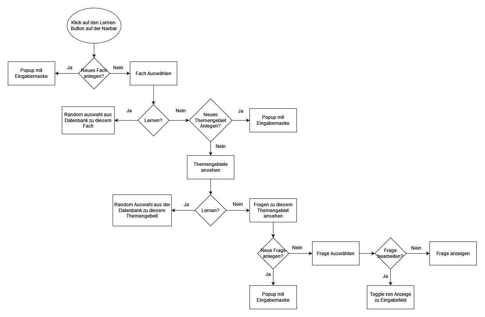

% Report LaMa (Learn and Management App)

# W-Fragen
Wer
Wo
Wann
Was
Wieso

---
- [X] Titel
- [ ] Projektdefinition 
- [ ] Anforderungsanalyse
  - [ ] Muss, 
  - [ ] Soll, 
  - [ ] Kann Ziele
- [ ] UseCases
  - 5 Uscases für die APP
  - [ ] Aktivitätsdiagramme
- [ ] ER - Diagramme
  - [ ] Datenbank Modell
- [ ] Timeline

[//]: # (# Zusammenfassung)
# Projektdefinition
Dies ist das Backend zu einer Lern-Plattform, wo Fragen und Antworten eingegeben und abgeprüft werden können.
Die Fragen werden zufällig aus der Datenbank ausgelesen und dem User zum Lernen vorgelegt.
Die Fragen müssen vom User selbst, als richtig oder falsch beantwortet angegeben werden.
Es gibt ein Punktesystem, dass öfters richtig beantwortete Fragen seltener dem User vorgelegt werden und er somit neue Fragen lernen kann.
Zusätzlich kann dieses Punktesystem anhand von einer Statistik abgerufen werden und eventuell anhand von einem Graphen dargestellt werden.
Dennoch werden auch oft gut beantworte Fragen gelegentlich vorgelegt, um diese nicht zu vergessen.

# Einleitung
Mit dieser API biete ich die Möglichkeit für Schulen, Universitäten und diversen anderen Ausbildungseinrichtungen eine Sammelstätte für Fächer, Themengebiete, Fragen und Antworten.
Es ist möglich, Fragen und Antworten anzulegen und mit Fächern UND Themengebieten zu kombinieren, um die Möglichkeit zu bieten, Fragen zu gewissen Fächern allgemein oder spezifiziert zu einem gewissen Themengebiet auszulesen.
Zusätzlich gibt es auch ein Punktesystem, womit man auch anhand einer Statistik auslesen kann, wie der Lernerfolg ist, welche Fragen gut beantwortet wurden und welche Fragen besser geübt werden müssen.

# Hauptteil
## Anforderungsanalyse
### Muss Ziele
### Kann Ziele
### Soll Ziele
## UseCases
##### Beschreibung:
###### Fach
Man kann sowohl Fächer anlegen und bearbeiten als auch in die einzelnen Fächer hinein gehen und die Themengebiete sehen. Zusätzlich ist es möglich alle Fragen die in diesem Fach hinterlegt sind zu lernen/spielen.

- `Neues Fach Anlegen:`
  - Mit einem Klick auf den '+' Button öffnet sich ein Popup-Fenster in dem ein Eingabefeld ist, wo der Name des Fachs eingegeben werden soll. Nach bestätigung des 'Speichern' Buttons, wird dieser Name mittels Post-Request in die Datenbank gespeichert.

- `Bestehendes Fach bearbeiten:`
  - Mit einem langen Klick auf das Fach, öffnet sich ein Kontext Menü wo ein 'Bearbeiten' Button erscheint. Mit dem Klick auf den Button, Verändert sich die Anzeige dieses einen Fachs auf ein Eingabefeld um den Namen des Fachs zu verändern/bearbeiten. Mit einem weiteren Klick auf den 'Speichern' Button, wird der neue Wert in die Datenbank geupdated und das Eingabefeld wird wieder zur normalen anzeige.

- `Fragen zu einem Fach lernen:`
  - Mit einem Klick auf den Play-Button erscheint ein Popup-Feld wo gefragt wird wie viele Fragen aus dem Fragenpool ausgewählt werden sollen (oder ob alle ausgewählt werden). Nach Eingabe der Zahl und Bestätigung des Popups, werden zufällig Fragen aus dem Fragenpool genommen und mit jeder positiv beantworteten Frage einen Punkt dazu addiert oder bei falsch beantworteten Fragen wird ein Punkt abgezogen.
  - Ein Algorithmus wird dann die Häufigkeit der gestellten Fragen optimieren, um einen sehr guten Lernerfolg zu garantieren.
  

- `Prototyp:`

###### Themengebiet
Man kann sowohl Themengebiete anlegen und bearbeiten als auch in die einzelnen Themengebiete hinein gehen und die Fragen sehen. Zusätzlich ist es möglich alle Fragen, die in diesem Themengebiet hinterlegt sind zu lernen/spielen.

  - `Neues Themengebiet anlegen:`
  - Mit einem Klick auf den '+' Button öffnet sich ein Popup-Fenster in dem ein Eingabefeld ist, wo der Name des Themengebiets eingegeben werden soll. Nach bestätigung des 'Speichern' Buttons, wird dieser Name mittels Post-Request in die Datenbank gespeichert.

- `Bestehendes Themengebiet bearbeiten:`
  - Mit einem langen Klick auf das Themengebiet, öffnet sich ein Kontext Menü wo ein 'Bearbeiten' Button erscheint. Mit dem Klick auf den Button, Verändert sich die Anzeige dieses einen Fachs auf ein Eingabefeld um den Namen des Fachs zu verändern/bearbeiten. Mit einem weiteren Klick auf den 'Speichern' Button, wird der neue Wert in die Datenbank geupdated und das Eingabefeld wird wieder zur normalen anzeige.

- `Fragen zu einem Themengebiet lernen:`
  - Mit einem Klick auf den Play-Button erscheint ein Popup-Feld wo gefragt wird wie viele Fragen aus dem Fragenpool ausgewählt werden sollen (oder ob alle ausgewählt werden). Nach Eingabe der Zahl und Bestätigung des Popups, werden zufällig Fragen aus dem Fragenpool genommen und mit jeder positiv beantworteten Frage einen Punkt dazu addiert oder bei falsch beantworteten Fragen wird ein Punkt abgezogen.
  - Ein Algorithmus wird dann die Häufigkeit der gestellten Fragen optimieren, um einen sehr guten Lernerfolg zu garantieren.

- `Prototyp`

###### Frage
- Man kann in die einzelnen Fragen hinein gehen und neue Fragen anlegen

###### Antwort
- Man kann bestehende Fragen und dessen Antworten bearbeiten. 

[//]: # (![]&#40;./img/Screenshot_2.png&#41;)

## Aktivitätsdiagramm / Ablaufdiagramm

## Beziehungen
### DatenbankModell

- Ein Fach kann mehrere Fragen haben (1:n)
- Ein Themengebiet kann mehrere Fragen haben (1:n)
- Ein Fach kann mehrere Themengebiete haben (1:n)
- Eine Frage kann mehrere Antworten haben (1:n)

## Beschreibung der Beziehungen
- Man kann alle Fragen (inklusive deren Antworten) die mit einem Fach verbunden sind auslesen.
  - Fragen werden zufällig aus der Datenbank ausgelesen
- Man kann alle Fragen (inklusive deren Antworten) die mit einem Themengebiet verbunden sind auslesen.
  - Fragen werden zufällig aus der Datenbank ausgelesen
- Jede Frage hat 1 oder mehrere Antworten

## CRUD Operationen / Technische Dokumentation
### Fach
- Create:
  - Neue Fächer müssen erstellt werden können
- Update:
  - Bestehende Fächer müssen bearbeitet werden können
- Read:
  - Bestehende Fächer müssen auslesbar sein
- Delete
  - Fächer müssen auch gelöscht werden können - dabei werden auch alle Themengebiete und alle Fragen und Antworten die damit verbunden sind gelöscht

### Themengebiet
- Create
  - Neue Themengebiete müssen erstellt werden können
- Update
  - Bestehende Themengebiete müssen bearbeitet werden können
- Read
  - Bestehende Themengebiete müssen auslesbar sein
- Delete
  - Themengebiete müssen auch gelöscht werden können - dabei werden auch alle Fragen und Antworten die an dieses Themengebiet gebunden sind gelöscht!

### Frage
- Create
  - Neue Fragen müssen erstellt werden können
- Update
  - Bestehende Fragen müssen bearbeitet werden können
- Read
  - Fragen müssen anhand von der Fach-ID oder der Themengebeits-Id auslesbar sein
- Delete
  - Fragen müssen auch gelöscht werden können - dabei werden auch die Antworten die damit verbunden sind gelöscht!

### Antwort
- Create
  - Neue Antworten müssen erstellt werden können
- Update
  - Bestehende Antworten müssen bearbeitet werden können
- Read
  - Antworten können NUR mit der Frage selbst ausgelesen werden!
- Delete
  - Antworten können nur gelöscht werden, wenn diese leer sind oder die Frage selbst gelöscht wird.

## Timeline