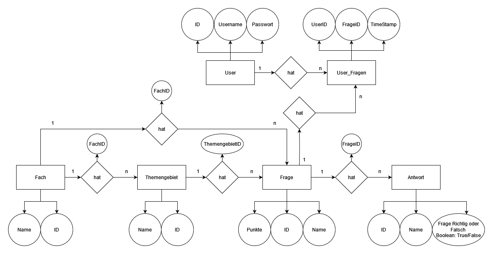

% Report LaMa (Learn and Management App)

<!-- ---
- [X] Titel
- [x] Projektdefinition 
- [x] Anforderungsanalyse
  - [x] Muss, 
  - [x] Soll, 
  - [x] Kann Ziele
- [x] UseCases
  - 5 Uscases für die APP
  - [x] Aktivitätsdiagramme
- [x] ER - Diagramme für Datenbank
  - [x] Datenbank Modell
- [ ] Timeline -->

[//]: # (# Zusammenfassung)

- [Einleitung](#einleitung)
- [Anforderungsanalyse](#anforderungsanalyse)
  - [Muss Ziele](#muss-ziele)
  - [Kann Ziele](#kann-ziele)
  - [Aktivitätsdiagramm / Ablaufdiagramm](#aktivitätsdiagramm--ablaufdiagramm)
  - [UseCases](#usecases)
    - [User](#user)
      - [`UC_01` Neuen User anlegen](#uc_01-neuen-user-anlegen)
      - [`UC_02` Mit Bestehendem User anmelden](#uc_02-mit-bestehendem-user-anmelden)
    - [Fach](#fach)
      - [`UC_03` Neues Fach Anlegen](#uc_03-neues-fach-anlegen)
      - [`UC_04` Bestehendes Fach bearbeiten](#uc_04-bestehendes-fach-bearbeiten)
      - [`UC_05` Bestehendes Fach löschen](#uc_05-bestehendes-fach-löschen)
      - [`UC_06` Fragen zu einem Fach lernen](#uc_06-fragen-zu-einem-fach-lernen)
    - [Themengebiet](#themengebiet)
      - [`UC_07` Neues Themengebiet anlegen](#uc_07-neues-themengebiet-anlegen)
      - [`UC_08` Bestehendes Themengebiet bearbeiten](#uc_08-bestehendes-themengebiet-bearbeiten)
      - [`UC_09` Bestehendes Themengebiet löschen](#uc_09-bestehendes-themengebiet-löschen)
      - [`UC_10` Fragen zu einem Themengebiet lernen](#uc_10-fragen-zu-einem-themengebiet-lernen)
    - [Frage](#frage)
      - [`UC_11` Neue Frage anlegen](#uc_11-neue-frage-anlegen)
      - [`UC_12` Bestehende Frage bearbeiten](#uc_12-bestehende-frage-bearbeiten)
      - [`UC_13` Bestehende Frage Löschen](#uc_13-bestehende-frage-löschen)
- [Algorithmus für die Fragen-Auswahl](#algorithmus-für-die-fragen-auswahl)
- [Datenbank](#datenbank)
  - [Modell](#modell)
  - [Beziehungen](#beziehungen)
- [Timeline](#timeline)
  - [Woche 1](#woche-1)
  - [Woche 2](#woche-2)
  - [Woche 3](#woche-3)
  - [Woche 4](#woche-4)
  - [Woche 5](#woche-5)
  - [Woche 6](#woche-6)

# Einleitung
Dies ist das Backend zu einer Lernplattform, in welcher Fragen und Antworten eingegeben und abgeprüft werden können. Diese API bietet eine Sammelstätte für Schulen, Universitäten und diverse andere Ausbildungseinrichtungen für Fächer, Themengebiete, Fragen und Antworten. Es können Fragen mit dazugehörigen Antworten angelegt, bearbeitet und gelöscht werden. Jede Frage wird sowohl einem Fach als auch einem Themengebiet zugewiesen, wodurch Fragen zu Fächern oder Themengebieten ausgelesen und gelernt werden können.

Als nicht-triviale Schwierigkeit werden die zum Lernen präsentierten Fragen von einem Algorithmus ausgewählt der öfters richtig beantwortete Fragen schwächer und besonders oft falsch beantwortete Fragen stärker gewichtet. Weiters wird eine Statistik über den Lernerfolg zur Verfügung gestellt.

# Anforderungsanalyse
## Muss Ziele
- Management (CRUD) für Fächer, Themengebiete und Fragenkatalog
- Übung von Fragen basiert sowohl auf Fächern oder Themengebieten in Form von Wahr-oder-Falsch-Spielen
- Algorithmus für eine gewichtet-randomisierte Auswahl bereits oft richtig beantworteter Fragen
- User Login
- User Registrierung

## Kann Ziele
- Statistik über Lernerfolg nach einer Lern-Spiel-Runde
- Diversität der Abfragemethode
  - Multiple Choice
  - Single Choice
- Statisiken aller Fragen/Fächer/Themengebiete
- User Authentifizierung

## Aktivitätsdiagramm / Ablaufdiagramm

## UseCases
### User
Der User muss in der App registriert und angemeldet sein um diese benutzen zu können. Dafür muss ein Benutzername und ein Passwort angegeben werden, die in die Datenbank gespeichert werden.

#### `UC_01` Neuen User anlegen
1. Öffne die App. Es soll sich eine Anmeldemaske mit zwei Eingabefeldern für Benutzername und Paswort öffnen
2. Klicke auf den "Registrieren"-Button. Es soll sich eine Registierungsmaske mit zwei Eingabefelder für Benutzername und Passwort öffnen.
3. Befülle beide Eingabefelder mit dem Benutzernamen und dem Passwort mit dem du dich anmelden möchtest
4. Klicke auf den "Registrieren"-Button. Es soll sich die Startseite der App öffnen

#### `UC_02` Mit Bestehendem User anmelden
1. Öffne die App. Es soll sich eine Anmeldemaske mit zwei Eingabefeldern für Benutzername und Paswort öffnen
2. Fülle Benutzername und Passwort mit den bereits registrierten Daten aus. Es soll sich die Startseite der App öffnen

### Fach
Man kann sowohl Fächer anlegen, bearbeiten und löschen als auch die einzelnen Fächer öffnen und deren Themengebiete sehen. Zusätzlich ist es möglich alle Fragen, die in diesem Fach hinterlegt sind, zu lernen/spielen.

#### `UC_03` Neues Fach Anlegen

1. Klicke auf den "+"-Button. Es soll sich ein Popup-Fenster öffnen.
2. Gib einen Namen für das neue Fach an.
3. Klicke auf den "Speichern"-Button. Das Popup-Fenster soll sich schließen.
4. Überprüfe, dass das neue Fach in der Liste angezeigt wird.

#### `UC_04` Bestehendes Fach bearbeiten

1. Klicke lang auf das zu bearbeitende Fach. Es sollte sich ein Kontext-Menü öffnen das einen "Bearbeiten"-Button enthält.
2. Klicke den "Bearbeiten"-Button. Das Fach sollte nun in einem Eingabefeld dargestellt werden.
3. Verändere den Namen des Fachs.
4. Klicke auf den "Speichern"-Button.
5. Überprüfe, dass der Name des Fachs geändert dargestellt wird.

#### `UC_05` Bestehendes Fach löschen

1. Klicke lang auf das zu löschende Fach. Es sollte sich ein Kontext-Menü öffnen das einen "Löschen"-Button enthält.
2. Klicke den "Löschen"-Button. Es sollte sich ein Popup-Fenster öffnen mit dem man das Löschen bestätigen kann.
3. Bestätige das Löschen.
4. Überprüfe, dass sowohl das Fach, als auch alle Themengebiete und alle Fragen mitsamt deren Antworten gelöscht sind.

#### `UC_06` Fragen zu einem Fach lernen

1. Klicke auf den "Play"-Button des zu lernenden Fachs. Es sollte sich die Lern-Ansicht dieses Fachs mit einer augenscheinlich zufälligen Frage öffnen.
2. Wähle die richtigen Antworten aus.
3. Klicke auf den "Überprüfen"-Button.
4. Überprüfe, dass die Antworten korrekt als richtig oder falsch markiert wurden. Es sollen ein "Stopp"- und ein "Weiter"-Button angezeigt werden.
5. Klicke auf den "Weiter"-Button. Es soll eine neue Frage geladen werden.
6. Beantworte diese Frage falsch.
7. Klicke auf den "Überprüfen"-Button.
8. Wiederhole Schritt 4.
9. Klicke auf den "Stopp"-Button. Es soll eine Zusammenfassung der Antwortergebnisse gezeigt werden.
10. Überprüfe, ob die Zusammenfassung korrekt ist.

### Themengebiet
Man kann sowohl Themengebiete anlegen, bearbeiten und löschen als auch in die einzelnen Themengebiete hinein gehen und die Fragen sehen. Zusätzlich ist es möglich alle Fragen, die in diesem Themengebiet hinterlegt sind zu lernen/spielen.

#### `UC_07` Neues Themengebiet anlegen

1. Klicke auf das Fach, dem ein Themengebiet hinzugefügt werden soll. Es soll eine Liste der Themengebiete dieses Fachs angezeigt werden.
2. Klicke auf den "+"-Button. Es soll sich ein Popup-Fenster öffnen.
3. Gib einen Namen für das neue Themengebiet an.
4. Klicke auf den "Speichern"-Button. Das Popup-Fenster soll sich schließen.
5. Überprüfe, dass das neue Themengebiet in der Liste angezeigt wird.

#### `UC_08` Bestehendes Themengebiet bearbeiten

1. Klicke auf das Fach, dessen Themengebiet bearbeitet werden soll. Es soll eine Liste der Themengebiete dieses Fachs angezeigt werden.
2. Klicke lang auf das zu bearbeitende Themengebiet. Es sollte sich ein Kontext-Menü öffnen das einen "Bearbeiten"-Button enthält.
3. Klicke den "Bearbeiten"-Button. Das Themengebiet sollte nun in einem Eingabefeld dargestellt werden.
4. Verändere den Namen des Themengebiet.
5. Klicke auf den "Speichern"-Button.
6. Überprüfe, dass der Name des Themengebiet geändert dargestellt wird.

#### `UC_09` Bestehendes Themengebiet löschen

1. Klicke auf das Fach, dessen Themengebiet gelöscht werden soll. Es soll eine Liste der Themengebiete dieses Fachs angezeigt werden.
2. Klicke lang auf das zu löschende Themengebiet. Es sollte sich ein Kontext-Menü öffnen das einen "Löschen"-Button enthält.
3. Klicke den "Löschen"-Button. Es sollte sich ein Popup-Fenster öffnen mit dem man das Löschen bestätigen kann.
4. Bestätige das Löschen.
5. Überprüfe, dass sowohl das Themengebiet, als auch alle Fragen mitsamt deren Antworten gelöscht sind.

#### `UC_10` Fragen zu einem Themengebiet lernen

1. Klicke auf das Fach, dessen Themengebiet gelernt werden soll. Es soll eine Liste der Themengebiete dieses Fachs angezeigt werden.
2. Klicke auf den "Play"-Button des zu lernenden Themengebiet. Es sollte sich die Lern-Ansicht dieses Themengebiet mit einer augenscheinlich zufälligen Frage öffnen.
3. Wähle die richtigen Antworten aus.
4. Klicke auf den "Überprüfen"-Button.
5. Überprüfe, dass die Antworten korrekt als richtig oder falsch markiert wurden. Es sollen ein "Stopp"- und ein "Weiter"-Button angezeigt werden.
6. Klicke auf den "Weiter"-Button. Es soll eine neue Frage geladen werden.
7. Beantworte diese Frage falsch.
8. Klicke auf den "Überprüfen"-Button.
9.  Wiederhole Schritt 4.
10. Klicke auf den "Stopp"-Button. Es soll eine Zusammenfassung der Antwortergebnisse gezeigt werden.
11. Überprüfe, ob die Zusammenfassung korrekt ist.

### Frage
Man kann sowohl Fragen anlegen, bearbeiten und löschen als auch in die Detail Ansicht hinein gehen und die Antwort zu der Frage sehen und zu bearbeiten.

|                                     |                                     |
| :---------------------------------: | :---------------------------------: |
|  |  |

#### `UC_11` Neue Frage anlegen

1. Klicke auf das Fach, dem eine Frage hinzugefügt werden soll. Es soll eine Liste der Themengebiete dieses Fachs angezeigt werden.
2. Klicke auf das Themengebiet, dem eine Frage hinzugefügt werden soll. Es soll eine Liste der Fragen dieses Themengebiets angezeigt werden.
3. Klicke auf den "+"-Button. Es soll sich ein Popup-Fenster öffnen.
4. Gib sowohl die Frage als auch dessen Antworten ein.
5. Klicke auf den "Speichern"-Button. Das Popup-Fenster soll sich schließen.
6. Überprüfe, dass die neue Frage in der Liste angezeigt wird.

#### `UC_12` Bestehende Frage bearbeiten

1. Klicke auf das Fach, dessen Frage bearbeitet werden soll. Es soll eine Liste der Themengebiete dieses Fachs angezeigt werden.
2. Klicke auf das Themengebiet, dessen Frage bearbeitet werden soll. Es soll eine Liste der Fragen dieses Themengebiets angezeigt werden.
3. Klicke lang auf die zu bearbeitende Frage. Es sollte sich ein Kontext-Menü öffnen das einen "Bearbeiten"-Button enthält.
4. Klicke den "Bearbeiten"-Button. Es soll sich ein Popup-Fenster öffnen in dem die Frage bearbeitet werden können.
5. Verändere den Text von Frage und Antworten.
6. Schalte eine Antwort von "Richtig" auf "Falsch".
7. Klicke auf den "Speichern"-Button.
8. Überprüfe, dass die veränderten Werte richtig dargestellt werden.

#### `UC_13` Bestehende Frage Löschen

1. Klicke auf das Fach, dessen Frage gelöscht werden soll. Es soll eine Liste der Themengebiete dieses Fachs angezeigt werden.
2. Klicke auf das Themengebiet, dessen Frage gelöscht werden soll. Es soll eine Liste der Fragen dieses Themengebiets angezeigt werden.
3. Klicke lang auf die zu bearbeitende Frage. Es sollte sich ein Kontext-Menü öffnen das einen "Löschen"-Button enthält.
4. Klicke den "Löschen"-Button.
5. Überprüfe, dass die Frage aus der Liste entfernt wurde.

# Algorithmus für die Fragen-Auswahl
> Das Backend soll einen nicht-trivialen Algorithmus implementieren, der - ähnlich den Algorithmen die in Social Media Plattformen in Verwendung sind - basierend auf der Nutzungsdaten des User eine personalisierte Auswahl an Fragen erstellt.
>
> Folgende Punkte sollten in die Berechnung einfliessen:
> * Das Ergebnisse der letzten Versuche (5?)
> * Wie weit die letzten Versuche in der Vergangenheit liegen
> * Die absolute Anzahl an Versuchen
>
> Der Algorithmus sollte eine Art Gewicht berechnen, welches auch in der Datenbank abzuspeichern ist. Die für die Berechnung notwendigen Daten sollen auch abgespeichert sein, damit die Berechnung wiederholt werden kann. Die Berechnung sollte bei gleichen Eingaben auch immer gleiche Ausgaben erzeugen. Eine leichte Randomisierung der dargestellten Fragen ist erwünscht, allerdings sollte dies in der serverseitigen API-Implementierung passieren und nicht direkt Teil des Algorithmus sein.
>
> Die Gewichtung könnte mithilfe eines gewichteten Arithmetischen Mittels (Durchschnitt mit Gewichtung) erfolgen.

# Datenbank
## Modell

## Beziehungen
- Ein Fach kann mehrere Fragen haben (1:n)
- Ein Themengebiet kann mehrere Fragen haben (1:n)
- Ein Fach kann mehrere Themengebiete haben (1:n)
- Eine Frage kann mehrere Antworten haben (1:n)

# Timeline
## Woche 1
- Initialisierung des SpringBoot Projekts mit Anbindung an die Datenbank
- CRUD-Operationen für Fächer und Themengebiete implementieren und mit der Datenbank integrieren
- API Endpunkte für das Erstellen, Aktualisieren, Auslesen und Löschen von Fächern und Themengebieten hinzufügen

## Woche 2
- CRUD-Operationen für Fragen und Antworten implementieren und mit der Datenbank integrieren
- API-Endpunkte für das Erstellen, Aktualisieren, Auslesen und Löschen von Fragen entwickeln

## Woche 3
- Einen Algorithmus erstellen, um zufällige Fragen aus der Datenbank auszuwählen und sie dem Benutzer zum Lernen vorzulegen.
- Ein Punktesystem implementieren, um die Leistung des Benutzers zu verfolgen und die Fragehäufigkeit entsprechend anzupassen.

## Woche 4
- API-Endpunkte entwickeln, um Statistiken über den Lernfortschritt und die Leistung des Benutzers zu generieren.
- Die Option hinzufügen, Statistiken mithilfe von Diagrammen darzustellen.

## Woche 5
- Ausführliche Tests und Debugging des Backend-APIs durchführen.
- Bei Bedarf Verbesserungen und Optimierungen vornehmen.

## Woche 6
- Die Dokumentation und Benutzeranleitungen für das Backend-API abschließen.
- Ein umfassender Systemtest durchführen, um sicherzustellen, dass alle Funktionen wie erwartet funktionieren.