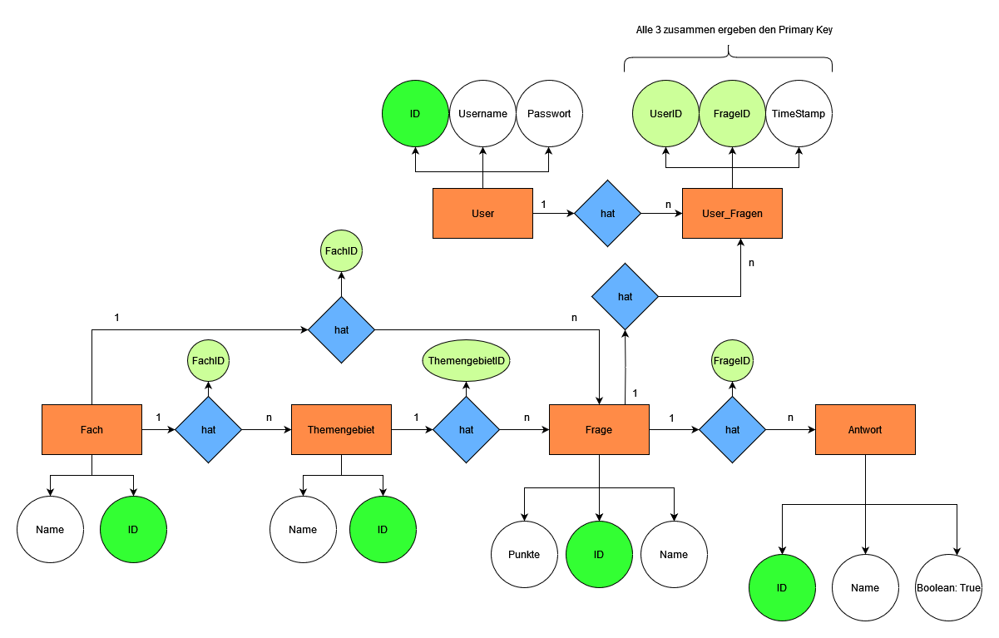

% Report LaMa (Learn and Management App)

---
- [X] Titel
- [x] Projektdefinition 
- [x] Anforderungsanalyse
  - [x] Muss, 
  - [x] Soll, 
  - [x] Kann Ziele
- [x] UseCases
  - 5 Uscases für die APP
  - [x] Aktivitätsdiagramme
- [x] ER - Diagramme für Datenbank
  - [x] Datenbank Modell
- [ ] Timeline

[//]: # (# Zusammenfassung)
# Projektdefinition
Dies ist das Backend zu einer Lern-Plattform, wo Fragen und Antworten eingegeben und abgeprüft werden können.
Die Fragen werden zufällig aus der Datenbank ausgelesen und dem User zum Lernen vorgelegt.
Die Fragen müssen vom User selbst, als richtig oder falsch beantwortet angegeben werden.
Es gibt ein Punktesystem, dass öfters richtig beantwortete Fragen seltener dem User vorgelegt werden und er somit neue Fragen lernen kann.
Zusätzlich kann dieses Punktesystem anhand von einer Statistik abgerufen werden und eventuell anhand von einem Graphen dargestellt werden.
Dennoch werden auch oft gut beantworte Fragen gelegentlich vorgelegt, um diese nicht zu vergessen.

# Einleitung
Mit dieser API biete ich die Möglichkeit für Schulen, Universitäten und diversen anderen Ausbildungseinrichtungen eine Sammelstätte für Fächer, Themengebiete, Fragen und Antworten.
Es ist möglich, Fragen und Antworten anzulegen und mit Fächern UND Themengebieten zu kombinieren, um die Möglichkeit zu bieten, Fragen zu gewissen Fächern allgemein oder spezifiziert zu einem gewissen Themengebiet auszulesen.
Zusätzlich gibt es auch ein Punktesystem, womit man auch anhand einer Statistik auslesen kann, wie der Lernerfolg ist, welche Fragen gut beantwortet wurden und welche Fragen besser geübt werden müssen.

# Anforderungsanalyse
## Muss Ziele
- Fach
  - Fach hinzufügen
  - Fach bearbeiten
  - Fach löschen
- Themengebiet
  - Themengebiet hinzufügen
  - Themengebiet bearbeiten
  - Thmengebiet löschen
- Frage
  - Frage hinzufügen
  - Frage bearbeiten
  - Frage löschen
- Antwort
  - Antwort hinzufügen
  - Antwort bearbeiten
  - Einzelne Antworten löschen

- Algorithmus für die unregelmäßige Ausgabe bereits oft richtig beantworteter Fragen
## Kann Ziele
- Statistik über Lernerfolg nach einer Lern-Spiel-Runde
- Generelle Auswertung der Statisiken aller Fragen/Fächer/Themengebiete
  

# Aktivitätsdiagramm / Ablaufdiagramm

## UseCases
###### Fach
Man kann sowohl Fächer anlegen, bearbeiten und löschen als auch in die einzelnen Fächer hinein gehen und die Themengebiete sehen. Zusätzlich ist es möglich alle Fragen die in diesem Fach hinterlegt sind zu lernen/spielen.

- `Neues Fach Anlegen:`
  - Mit einem Klick auf den '+' Button öffnet sich ein Popup-Fenster in dem ein Eingabefeld ist, wo der Name des Fachs eingegeben werden soll. Nach bestätigung des 'Speichern' Buttons, wird dieser Name mittels Post-Request in die Datenbank gespeichert.

- `Bestehendes Fach bearbeiten:`
  - Mit einem langen Klick auf das Fach, öffnet sich ein Kontext Menü wo ein 'Bearbeiten' Button erscheint. Mit dem Klick auf den Button, Verändert sich die Anzeige dieses einen Fachs auf ein Eingabefeld um den Namen des Fachs zu verändern/bearbeiten. Mit einem weiteren Klick auf den 'Speichern' Button, wird der neue Wert in die Datenbank geupdated und das Eingabefeld wird wieder zur normalen anzeige.

- `Bestehendes Fach löschen:`
  - Mit einem langen Klick auf das Fach, öffnet sich ein Kontext Menü wo ein 'Löschen' Button erscheint. Mit einem Klick auf den Button, öffnet sich ein Popup Fenster wo nachgefragt wird ob man dieses Fach wirklich löschen möchte.
  - Bestätigt man dieses Popup Fenster, werden sowohl Fach als auch alle Themengebiete und alle Fragen mit deren Antworten gelöscht.

- `Fragen zu einem Fach lernen:`
  - Mit einem Klick auf den Play-Button erscheint ein Popup-Feld wo gefragt wird wie viele Fragen aus dem Fragenpool ausgewählt werden sollen (oder ob alle ausgewählt werden). Nach Eingabe der Zahl und Bestätigung des Popups, werden zufällig Fragen aus dem Fragenpool genommen und mit jeder positiv beantworteten Frage einen Punkt dazu addiert oder bei falsch beantworteten Fragen wird ein Punkt abgezogen.
  - Ein Algorithmus wird dann die Häufigkeit der gestellten Fragen optimieren, um einen sehr guten Lernerfolg zu garantieren.
  

- `Prototyp:`

###### Themengebiet
Man kann sowohl Themengebiete anlegen, bearbeiten und löschen als auch in die einzelnen Themengebiete hinein gehen und die Fragen sehen. Zusätzlich ist es möglich alle Fragen, die in diesem Themengebiet hinterlegt sind zu lernen/spielen.

  - `Neues Themengebiet anlegen:`
  - Mit einem Klick auf den '+' Button öffnet sich ein Popup-Fenster in dem ein Eingabefeld ist, wo der Name des Themengebiets eingegeben werden soll. Nach bestätigung des 'Speichern' Buttons, wird dieser Name mittels Post-Request in die Datenbank gespeichert.

- `Bestehendes Themengebiet bearbeiten:`
  - Mit einem langen Klick auf das Themengebiet, öffnet sich ein Kontext Menü wo ein 'Bearbeiten' Button erscheint. Mit dem Klick auf den Button, Verändert sich die Anzeige dieses einen Fachs auf ein Eingabefeld um den Namen des Fachs zu verändern/bearbeiten. Mit einem weiteren Klick auf den 'Speichern' Button, wird der neue Wert in die Datenbank geupdated und das Eingabefeld wird wieder zur normalen anzeige.

- `Bestehendes Themengebiet löschen:`
  - Mit einem langen Klick auf das Themengebiet, öffnet sich ein Kontext Menü wo ein 'Löschen' Button erscheint. Mit einem Klick auf den Button, öffnet sich ein Popup Fenster wo nachgefragt wird ob man dieses Themengebiet wirklich löschen möchte.
  - Bestätigt man dieses Popup Fenster, werden sowohl Themengebiete als auch alle Fragen mit deren Antworten gelöscht.

- `Fragen zu einem Themengebiet lernen:`
  - Mit einem Klick auf den Play-Button erscheint ein Popup-Feld wo gefragt wird wie viele Fragen aus dem Fragenpool ausgewählt werden sollen (oder ob alle ausgewählt werden). Nach Eingabe der Zahl und Bestätigung des Popups, werden zufällig Fragen aus dem Fragenpool genommen und mit jeder positiv beantworteten Frage einen Punkt dazu addiert oder bei falsch beantworteten Fragen wird ein Punkt abgezogen.
  - Ein Algorithmus wird dann die Häufigkeit der gestellten Fragen optimieren, um einen sehr guten Lernerfolg zu garantieren.

- `Prototyp`

###### Frage
Man kann sowohl Fragen anlegen, bearbeiten und löschen als auch in die Detail Ansicht hinein gehen und die Antwort zu der Frage sehen und zu bearbeiten.

- `Neue Frage anlegen:`
  - Mit einem Klick auf den '+' Button öffnet sich ein Popup-Fenster in dem ein Eingabefeld ist, wo die Frage und dessen Antwort eingegeben werden soll. 
  - Mit einem weiteren '+' Button in diesem Popup Fenster, erscheint ein weiteres Eingabefeld um mehr als eine Antwort angeben zu können. (Kann für weitere Antworten öfters genutzt werden!)
  - Nach Bestätigung des 'Speichern' Buttons, wird dieser Name mittels Post-Request in die Datenbank gespeichert.

- `Bestehende Frage bearbeiten:`
  - Mit einem Klick auf die Frage, öffnet sich eine Detail Ansicht wo man zu einem Bearbeiten Button kommt. Mit dem Klick auf den bearbeiten Button, Verändert sich die Anzeigen von Frage und Antwort/Antowrten in Eingabefelder um die Frage und die Antworten verändern/bearbeiten. Mit einem weiteren Klick auf den 'Speichern' Button, werden die neuen Werte in die Datenbank geupdated und die Eingabefelder werden wieder zur normalen anzeige.

- `Bestehende Frage Löschen:`
  - Mit einem langen Klick auf die Frage, öffnet sich ein Kontext Menü wo ein 'Löschen' Button erscheint. Mit einem Klick auf den Button, öffnet sich ein Popup Fenster wo nachgefragt wird ob diese Frage wirklich gelöscht werden soll.
  - Bestätigt man dieses Popup Fenster, wird die Frage mit allen dazugehörigen Antworten gelöscht.

- `Prototyp`

|                             |                             |
| :-------------------------: | :-------------------------: |
|  |  |

# Beziehungen
## DatenbankModell

- Ein Fach kann mehrere Fragen haben (1:n)
- Ein Themengebiet kann mehrere Fragen haben (1:n)
- Ein Fach kann mehrere Themengebiete haben (1:n)
- Eine Frage kann mehrere Antworten haben (1:n)

### Beschreibung der Beziehungen
- Man kann alle Fragen (inklusive deren Antworten) die mit einem Fach verbunden sind auslesen.
  - Fragen werden zufällig aus der Datenbank ausgelesen
- Man kann alle Fragen (inklusive deren Antworten) die mit einem Themengebiet verbunden sind auslesen.
  - Fragen werden zufällig aus der Datenbank ausgelesen
- Jede Frage hat 1 oder mehrere Antworten

## CRUD Operationen / Technische Dokumentation
### Fach
- Create:
  - Neue Fächer müssen erstellt werden können
- Update:
  - Bestehende Fächer müssen bearbeitet werden können
- Read:
  - Bestehende Fächer müssen auslesbar sein
- Delete
  - Fächer müssen auch gelöscht werden können - dabei werden auch alle Themengebiete und alle Fragen und Antworten die damit verbunden sind gelöscht

### Themengebiet
- Create
  - Neue Themengebiete müssen erstellt werden können
- Update
  - Bestehende Themengebiete müssen bearbeitet werden können
- Read
  - Bestehende Themengebiete müssen auslesbar sein
- Delete
  - Themengebiete müssen auch gelöscht werden können - dabei werden auch alle Fragen und Antworten die an dieses Themengebiet gebunden sind gelöscht!

### Frage
- Create
  - Neue Fragen müssen erstellt werden können
- Update
  - Bestehende Fragen müssen bearbeitet werden können
- Read
  - Fragen müssen anhand von der Fach-ID oder der Themengebeits-Id auslesbar sein
- Delete
  - Fragen müssen auch gelöscht werden können - dabei werden auch die Antworten die damit verbunden sind gelöscht!

### Antwort
- Create
  - Neue Antworten müssen erstellt werden können
- Update
  - Bestehende Antworten müssen bearbeitet werden können
- Read
  - Antworten können NUR mit der Frage selbst ausgelesen werden!
- Delete
  - Antworten können nur gelöscht werden, wenn diese leer sind oder die Frage selbst gelöscht wird.

# Timeline

- Woche 1:
  - Projektstruktur und Datenbank-Schema erstellen.
  - Grundlegende CRUD-Operationen für Fächer implementieren und mit der Datenbank integrieren.
  - API-Endpunkte für das Erstellen, Aktualisieren, Auslesen und Löschen von Fächern entwickeln.

- Woche 2:
  - CRUD-Operationen für Themengebiete implementieren und mit der Datenbank integrieren
  - API-Endpunkte für das Erstellen, Aktualisieren, Auslesen und Löschen von Themengebieten hinzufügen.

- Woche 3:
  - CRUD-Operationen für Fragen implementieren und mit der Datenbank integrieren.
  - API-Endpunkte für das Erstellen, Aktualisieren, Auslesen und Löschen von Fragen entwickeln.

- Woche 4:
  - CRUD-Operationen für Antworten implementieren und mit der Datenbank integrieren.
  - API-Endpunkte für das Erstellen, Aktualisieren, Auslesen und Löschen von Antworten hinzufügen.

- Woche 5:
  - Einen Algorithmus erstellen, um zufällige Fragen aus der Datenbank auszuwählen und sie dem Benutzer zum Lernen vorzulegen.
  - Ein Punktesystem implementieren, um die Leistung des Benutzers zu verfolgen und die Fragehäufigkeit entsprechend anzupassen.

- Woche 6:
  - API-Endpunkte entwickeln, um Statistiken über den Lernfortschritt und die Leistung des Benutzers zu generieren.
  - Die Option hinzufügen, Statistiken mithilfe von Diagrammen darzustellen.

- Woche 7:
  - Ausführliche Tests und Debugging des Backend-APIs durchführen.
  - Bei Bedarf Verbesserungen und Optimierungen vornehmen.

- Woche 8:
  - Das Backend auf einem Server oder einer Cloud-Plattform bereitstellen.
  - Leistungstests durchführen, um sicherzustellen, dass das System eine hohe Anzahl gleichzeitiger Benutzer verarbeiten kann.

- Woche 9:
  - Die Dokumentation und Benutzeranleitungen für das Backend-API abschließen.
  - Ein umfassender Systemtest durchführen, um sicherzustellen, dass alle Funktionen wie erwartet funktionieren.

- Woche 10:
  - Die Integration mit dem Frontend der Lernplattform vorbereiten.
  - Mit dem Frontend-Entwicklungsteam zusammenarbeiten, um eine nahtlose Integration zu gewährleisten.

- Woche 11:
  - Die Integration des Backend-APIs mit dem Frontend abschließen.
  - End-to-End-Tests durchführen, um die ordnungsgemäße Funktionsweise der gesamten Plattform sicherzustellen.

- Woche 12:
  - Das gesamte Projekt überprüfen und verbleibende Probleme oder Fehler beheben.
  - Zukünftige Updates und Verbesserungen basierend auf Benutzerfeedback und Anforderungen planen.